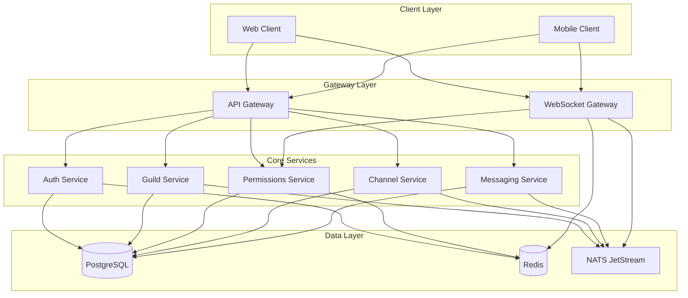
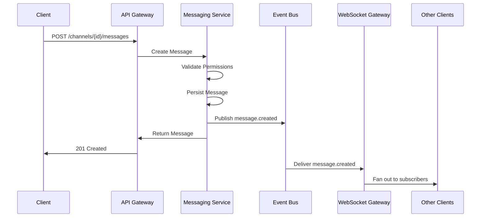
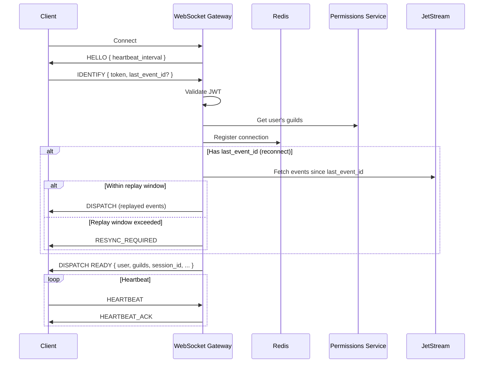

# Design Document

## Overview

This design document describes the architecture and implementation approach for the core text chat functionality of a Discord-like real-time communication platform. The system follows a microservices architecture with an event-driven design, enabling horizontal scalability and real-time message delivery.

The core services include:
- **Auth Service**: User registration, authentication, JWT/refresh token management, session handling
- **Guild Service**: Guild CRUD, membership, invites, bans
- **Permissions Service**: Role management, permission evaluation with Redis caching
- **Channel Service**: Channel CRUD, category grouping, ordering
- **Messaging Service**: Message persistence, pagination, editing/deletion
- **WebSocket Gateway**: Real-time connections, subscriptions, event fanout
- **Event Bus**: NATS JetStream for inter-service communication

## Architecture



### Event Flow Architecture



## Components and Interfaces

### 1. Auth Service

**Responsibilities:**
- User registration and credential validation
- JWT and refresh token issuance
- Session management across devices
- Token refresh and rotation

**API Endpoints:**
```
POST /auth/register
  Request: { email: string, password: string, username: string }
  Response: { user: User, tokens: TokenPair }

POST /auth/login
  Request: { email: string, password: string, device_info?: DeviceInfo }
  Response: { user: User, tokens: TokenPair, session_id: string }

POST /auth/refresh
  Request: { refresh_token: string }
  Response: { tokens: TokenPair }

POST /auth/logout
  Request: (authenticated)
  Response: { success: boolean }

GET /auth/sessions
  Request: (authenticated)
  Response: { sessions: Session[] }

DELETE /auth/sessions/{session_id}
  Request: (authenticated)
  Response: { success: boolean }
```

**Internal Interface:**
```typescript
interface AuthService {
  register(email: string, password: string, username: string): Promise<{ user: User; tokens: TokenPair }>;
  login(email: string, password: string, deviceInfo?: DeviceInfo): Promise<{ user: User; tokens: TokenPair; sessionId: string }>;
  refreshTokens(refreshToken: string): Promise<TokenPair>;
  logout(sessionId: string): Promise<void>;
  validateToken(jwt: string): Promise<TokenPayload>;
  getSessions(userId: Snowflake): Promise<Session[]>;
  revokeSession(userId: Snowflake, sessionId: string): Promise<void>;
  revokeAllSessions(userId: Snowflake): Promise<void>;
}
```

### 2. Guild Service

**Responsibilities:**
- Guild CRUD operations
- Membership management
- Invite generation and validation
- Ban management

**API Endpoints:**
```
POST /guilds
  Request: { name: string, icon?: string }
  Response: { guild: Guild }

GET /guilds/{guild_id}
  Response: { guild: Guild }

PATCH /guilds/{guild_id}
  Request: { name?: string, icon?: string }
  Response: { guild: Guild }

DELETE /guilds/{guild_id}
  Response: { success: boolean }

POST /guilds/{guild_id}/members
  Request: { invite_code: string }
  Response: { member: Member }

DELETE /guilds/{guild_id}/members/{user_id}
  Response: { success: boolean }

POST /guilds/{guild_id}/invites
  Request: { max_uses?: number, expires_in?: number }
  Response: { invite: Invite }

GET /guilds/{guild_id}/invites
  Response: { invites: Invite[] }

DELETE /guilds/{guild_id}/invites/{invite_code}
  Response: { success: boolean }

POST /guilds/{guild_id}/bans/{user_id}
  Request: { reason?: string }
  Response: { success: boolean }

DELETE /guilds/{guild_id}/bans/{user_id}
  Response: { success: boolean }
```

**Internal Interface:**
```typescript
interface GuildService {
  createGuild(ownerId: Snowflake, name: string): Promise<Guild>;
  getGuild(guildId: Snowflake): Promise<Guild>;
  updateGuild(guildId: Snowflake, updates: Partial<Guild>): Promise<Guild>;
  deleteGuild(guildId: Snowflake): Promise<void>;
  
  joinGuild(userId: Snowflake, inviteCode: string): Promise<Member>;
  leaveGuild(userId: Snowflake, guildId: Snowflake): Promise<void>;
  kickMember(guildId: Snowflake, userId: Snowflake): Promise<void>;
  banMember(guildId: Snowflake, userId: Snowflake, reason?: string): Promise<void>;
  unbanMember(guildId: Snowflake, userId: Snowflake): Promise<void>;
  
  createInvite(guildId: Snowflake, options: InviteOptions): Promise<Invite>;
  getInvites(guildId: Snowflake): Promise<Invite[]>;
  revokeInvite(guildId: Snowflake, inviteCode: string): Promise<void>;
  validateInvite(inviteCode: string): Promise<Invite>;
}
```

### 3. Permissions Service

**Responsibilities:**
- Role CRUD operations
- Role assignment to members
- Permission evaluation with caching
- Channel overwrite management

**API Endpoints:**
```
POST /guilds/{guild_id}/roles
  Request: { name: string, permissions: bigint, color?: string }
  Response: { role: Role }

PATCH /guilds/{guild_id}/roles/{role_id}
  Request: { name?: string, permissions?: bigint, position?: number }
  Response: { role: Role }

DELETE /guilds/{guild_id}/roles/{role_id}
  Response: { success: boolean }

PUT /guilds/{guild_id}/members/{user_id}/roles/{role_id}
  Response: { success: boolean }

DELETE /guilds/{guild_id}/members/{user_id}/roles/{role_id}
  Response: { success: boolean }

PUT /channels/{channel_id}/overwrites/{target_id}
  Request: { type: 'role' | 'member', allow: bigint, deny: bigint }
  Response: { overwrite: ChannelOverwrite }

DELETE /channels/{channel_id}/overwrites/{target_id}
  Response: { success: boolean }
```

**Internal Interface:**
```typescript
interface PermissionsService {
  createRole(guildId: Snowflake, name: string, permissions: bigint): Promise<Role>;
  updateRole(roleId: Snowflake, updates: Partial<Role>): Promise<Role>;
  deleteRole(roleId: Snowflake): Promise<void>;
  reorderRoles(guildId: Snowflake, rolePositions: { roleId: Snowflake; position: number }[]): Promise<void>;
  
  assignRole(guildId: Snowflake, userId: Snowflake, roleId: Snowflake): Promise<void>;
  removeRole(guildId: Snowflake, userId: Snowflake, roleId: Snowflake): Promise<void>;
  getMemberRoles(guildId: Snowflake, userId: Snowflake): Promise<Role[]>;
  
  setChannelOverwrite(channelId: Snowflake, targetId: Snowflake, type: 'role' | 'member', allow: bigint, deny: bigint): Promise<void>;
  deleteChannelOverwrite(channelId: Snowflake, targetId: Snowflake): Promise<void>;
  
  computePermissions(userId: Snowflake, channelId: Snowflake): Promise<bigint>;
  hasPermission(userId: Snowflake, channelId: Snowflake, permission: bigint): Promise<boolean>;
  invalidateCache(userId: Snowflake, guildId: Snowflake): Promise<void>;
}
```

**Permission Cache Invalidation Strategy:**

Cache invalidation is event-driven, asynchronous, with TTL fallback:

| Event | Cache Keys Invalidated |
|-------|----------------------|
| `role.updated` | All `(guild_id, *)` entries |
| `role.deleted` | All `(guild_id, *)` entries |
| `member_roles.updated` | Specific `(guild_id, user_id)` entry |
| `channel_overwrite.updated` | All `(channel_id, *)` entries |
| `channel_overwrite.deleted` | All `(channel_id, *)` entries |
| `member.removed/banned` | Specific `(guild_id, user_id)` entry |

Cache entries have a short TTL (e.g., 60 seconds) as fallback for missed invalidation events.

**Cache Key Format:**
```
permissions:{guild_id}:{channel_id}:{user_id} -> bigint (computed permissions)
```
```

### 4. Channel Service

**Responsibilities:**
- Channel CRUD operations
- Category management
- Channel ordering

**API Endpoints:**
```
POST /guilds/{guild_id}/channels
  Request: { name: string, type: ChannelType, parent_id?: Snowflake }
  Response: { channel: Channel }

GET /guilds/{guild_id}/channels
  Response: { channels: Channel[] }

PATCH /channels/{channel_id}
  Request: { name?: string, topic?: string, position?: number }
  Response: { channel: Channel }

DELETE /channels/{channel_id}
  Response: { success: boolean }
```

**Internal Interface:**
```typescript
interface ChannelService {
  createChannel(guildId: Snowflake, name: string, type: ChannelType, parentId?: Snowflake): Promise<Channel>;
  getChannel(channelId: Snowflake): Promise<Channel>;
  getGuildChannels(guildId: Snowflake): Promise<Channel[]>;
  updateChannel(channelId: Snowflake, updates: Partial<Channel>): Promise<Channel>;
  deleteChannel(channelId: Snowflake): Promise<void>;
  reorderChannels(guildId: Snowflake, positions: { channelId: Snowflake; position: number; parentId?: Snowflake }[]): Promise<void>;
}
```

### 5. Messaging Service

**Responsibilities:**
- Message creation with permission validation
- Message retrieval with pagination
- Message editing and deletion
- Mention parsing

**API Endpoints:**
```
POST /channels/{channel_id}/messages
  Request: { content: string }
  Response: { message: Message }

GET /channels/{channel_id}/messages
  Query: { before?: Snowflake, after?: Snowflake, limit?: number }
  Response: { messages: Message[] }

PATCH /channels/{channel_id}/messages/{message_id}
  Request: { content: string }
  Response: { message: Message }

DELETE /channels/{channel_id}/messages/{message_id}
  Response: { success: boolean }
```

**Internal Interface:**
```typescript
interface MessagingService {
  createMessage(channelId: Snowflake, authorId: Snowflake, content: string): Promise<Message>;
  getMessage(messageId: Snowflake): Promise<Message>;
  getMessages(channelId: Snowflake, options: PaginationOptions): Promise<Message[]>;
  updateMessage(messageId: Snowflake, authorId: Snowflake, content: string): Promise<Message>;
  deleteMessage(messageId: Snowflake, deleterId: Snowflake): Promise<void>;
}

interface PaginationOptions {
  before?: Snowflake;
  after?: Snowflake;
  limit?: number; // max 100
}
```

**Message Edit/Delete Conflict Resolution:**

When edit and delete events arrive out of order (race condition):

1. **Deletion dominates**: If `deleted_at` is set, message is treated as deleted
2. **Edit after delete**: Ignored - deleted messages cannot be edited
3. **Client-side handling**: Clients must check `deleted_at` before applying edits
4. **Read model**: Always filter out messages where `deleted_at IS NOT NULL`

```typescript
// Client-side event reducer
function applyMessageEvent(state: Message | null, event: MessageEvent): Message | null {
  if (event.type === 'MESSAGE_DELETE') {
    return null; // Remove from state
  }
  if (event.type === 'MESSAGE_UPDATE') {
    if (state?.deleted_at) {
      return state; // Ignore edit on deleted message
    }
    return { ...state, ...event.data };
  }
  return event.data;
}
```
```

### 6. WebSocket Gateway

**Responsibilities:**
- WebSocket connection management
- JWT authentication on connect
- Subscription management (guilds, channels)
- Event fanout from Event Bus to clients
- Heartbeat/keepalive

**Protocol:**
```typescript
// Client -> Server
interface ClientMessage {
  op: 'IDENTIFY' | 'HEARTBEAT' | 'SUBSCRIBE' | 'UNSUBSCRIBE' | 'RESUME';
  d: any;
}

// IDENTIFY payload
interface IdentifyPayload {
  token: string;
  last_event_id?: string; // For reconnection - replay events since this ID
}

// RESUME payload (alternative to IDENTIFY for quick reconnect)
interface ResumePayload {
  token: string;
  session_id: string;
  last_event_id: string;
}

// Server -> Client
interface ServerMessage {
  op: 'HELLO' | 'HEARTBEAT_ACK' | 'DISPATCH' | 'INVALID_SESSION' | 'RECONNECT' | 'RESYNC_REQUIRED';
  t?: string; // event type for DISPATCH
  s?: number; // sequence number for ordering
  d: any;
}

// RESYNC_REQUIRED - sent when replay window exceeded, client must re-fetch state
interface ResyncPayload {
  reason: 'replay_window_exceeded' | 'session_expired';
}

// Event types (t field)
type EventType = 
  | 'READY'
  | 'MESSAGE_CREATE'
  | 'MESSAGE_UPDATE'
  | 'MESSAGE_DELETE'
  | 'GUILD_CREATE'
  | 'GUILD_UPDATE'
  | 'GUILD_DELETE'
  | 'CHANNEL_CREATE'
  | 'CHANNEL_UPDATE'
  | 'CHANNEL_DELETE'
  | 'MEMBER_ADD'
  | 'MEMBER_REMOVE'
  | 'MEMBER_UPDATE'
  | 'ROLE_CREATE'
  | 'ROLE_UPDATE'
  | 'ROLE_DELETE';
```

**Connection Flow:**


**Reconnection and Resume Semantics:**

The Gateway supports session resumption to handle brief disconnections without losing events:

1. **Event Sequencing**: Each DISPATCH includes a sequence number (`s` field)
2. **Replay Window**: Gateway maintains a bounded replay window (e.g., 5 minutes or 1000 events per entity)
3. **Resume Flow**:
   - Client reconnects with `last_event_id` from last received event
   - Gateway replays missed events from JetStream
   - If replay window exceeded, Gateway sends `RESYNC_REQUIRED`
   - Client must then re-fetch full state via REST API

**Subscription Management:**

To prevent subscription explosion in large guilds:

1. **Guild-level events**: Always subscribed for all member guilds
   - GUILD_UPDATE, GUILD_DELETE
   - MEMBER_ADD, MEMBER_REMOVE, MEMBER_UPDATE
   - ROLE_CREATE, ROLE_UPDATE, ROLE_DELETE
   - CHANNEL_CREATE, CHANNEL_UPDATE, CHANNEL_DELETE

2. **Channel-level events**: Subscribed on-demand
   - MESSAGE_CREATE, MESSAGE_UPDATE, MESSAGE_DELETE
   - Client sends SUBSCRIBE when opening a channel
   - Client sends UNSUBSCRIBE when closing a channel

**Backpressure and Slow Consumer Handling:**

1. **Per-connection send buffer**: Bounded queue (e.g., 1000 events)
2. **Slow consumer detection**: If buffer fills, connection is terminated
3. **Rate limiting**: Max events per second per connection
4. **Memory bounds**: Total memory per connection capped

### 7. Snowflake ID Generator

**Structure (64-bit):**
```
| 42 bits timestamp | 10 bits worker ID | 12 bits sequence |
```

- Timestamp: milliseconds since custom epoch (e.g., 2024-01-01)
- Worker ID: identifies the generating node (0-1023)
- Sequence: counter for IDs generated in same millisecond (0-4095)

**Interface:**
```typescript
interface SnowflakeGenerator {
  generate(): Snowflake;
  parse(snowflake: Snowflake): { timestamp: number; workerId: number; sequence: number };
  getTimestamp(snowflake: Snowflake): Date;
}
```

### 8. Event Bus (NATS JetStream)

**Topics:**
- `guild.events` - Guild CRUD, membership changes
- `channel.events` - Channel CRUD
- `message.events` - Message CRUD
- `member.events` - Member join/leave/kick/ban
- `role.events` - Role CRUD, assignments

**Event Schema:**
```typescript
interface Event<T> {
  id: string;
  type: string;
  timestamp: number;
  data: T;
}

// Examples
interface MessageCreatedEvent {
  type: 'message.created';
  data: {
    message: Message;
    channel_id: Snowflake;
    guild_id: Snowflake;
  };
}

interface MemberJoinedEvent {
  type: 'member.joined';
  data: {
    guild_id: Snowflake;
    user: User;
    joined_at: string;
  };
}
```

## Data Models

### Core Types

```typescript
type Snowflake = string; // 64-bit ID as string for JSON compatibility

interface User {
  id: Snowflake;
  email: string;
  username: string;
  avatar?: string;
  created_at: Date;
}

interface Session {
  id: string;
  user_id: Snowflake;
  refresh_token_hash: string;
  device_info: DeviceInfo;
  created_at: Date;
  last_active_at: Date;
}

interface DeviceInfo {
  user_agent?: string;
  ip_address?: string;
  device_name?: string;
}

interface TokenPair {
  access_token: string;
  refresh_token: string;
  expires_in: number;
}

interface TokenPayload {
  sub: Snowflake; // user_id
  session_id: string;
  iat: number;
  exp: number;
}
```

### Guild Types

```typescript
interface Guild {
  id: Snowflake;
  owner_id: Snowflake;
  name: string;
  icon?: string;
  created_at: Date;
  deleted_at?: Date;
}

interface Member {
  guild_id: Snowflake;
  user_id: Snowflake;
  nickname?: string;
  joined_at: Date;
  roles: Snowflake[];
}

interface Invite {
  code: string;
  guild_id: Snowflake;
  creator_id: Snowflake;
  max_uses?: number;
  uses: number;
  expires_at?: Date;
  created_at: Date;
}

interface Ban {
  guild_id: Snowflake;
  user_id: Snowflake;
  reason?: string;
  banned_by: Snowflake;
  created_at: Date;
}
```

### Permission Types

```typescript
interface Role {
  id: Snowflake;
  guild_id: Snowflake;
  name: string;
  color?: string;
  position: number;
  permissions: bigint;
  created_at: Date;
}

interface ChannelOverwrite {
  channel_id: Snowflake;
  target_id: Snowflake;
  target_type: 'role' | 'member';
  allow: bigint;
  deny: bigint;
}

// Permission bits
const Permissions = {
  VIEW_CHANNEL:       1n << 0n,
  SEND_MESSAGES:      1n << 1n,
  READ_MESSAGE_HISTORY: 1n << 2n,
  MANAGE_MESSAGES:    1n << 3n,
  MANAGE_CHANNELS:    1n << 4n,
  MANAGE_GUILD:       1n << 5n,
  MANAGE_ROLES:       1n << 6n,
  KICK_MEMBERS:       1n << 7n,
  BAN_MEMBERS:        1n << 8n,
  CREATE_INVITES:     1n << 9n,
  ADMINISTRATOR:      1n << 10n,
} as const;
```

### Channel Types

```typescript
enum ChannelType {
  TEXT = 0,
  CATEGORY = 1,
}

interface Channel {
  id: Snowflake;
  guild_id: Snowflake;
  type: ChannelType;
  name: string;
  topic?: string;
  parent_id?: Snowflake; // category
  position: number;
  created_at: Date;
  deleted_at?: Date;
}
```

### Message Types

```typescript
interface Message {
  id: Snowflake;
  channel_id: Snowflake;
  author_id: Snowflake;
  content: string;
  mentions: Snowflake[];
  mention_roles: Snowflake[];
  created_at: Date;
  edited_at?: Date;
  deleted_at?: Date;
}
```

## Database Schema

```sql
-- Users and Auth
CREATE TABLE users (
  id BIGINT PRIMARY KEY,
  email VARCHAR(255) UNIQUE NOT NULL,
  username VARCHAR(32) NOT NULL,
  password_hash VARCHAR(255) NOT NULL,
  avatar VARCHAR(255),
  created_at TIMESTAMPTZ DEFAULT NOW()
);

CREATE TABLE sessions (
  id UUID PRIMARY KEY DEFAULT gen_random_uuid(),
  user_id BIGINT REFERENCES users(id) ON DELETE CASCADE,
  refresh_token_hash VARCHAR(255) NOT NULL,
  device_info JSONB,
  created_at TIMESTAMPTZ DEFAULT NOW(),
  last_active_at TIMESTAMPTZ DEFAULT NOW()
);

-- Guilds
CREATE TABLE guilds (
  id BIGINT PRIMARY KEY,
  owner_id BIGINT REFERENCES users(id),
  name VARCHAR(100) NOT NULL,
  icon VARCHAR(255),
  created_at TIMESTAMPTZ DEFAULT NOW(),
  deleted_at TIMESTAMPTZ
);

CREATE TABLE guild_members (
  guild_id BIGINT REFERENCES guilds(id) ON DELETE CASCADE,
  user_id BIGINT REFERENCES users(id) ON DELETE CASCADE,
  nickname VARCHAR(32),
  joined_at TIMESTAMPTZ DEFAULT NOW(),
  PRIMARY KEY (guild_id, user_id)
);

CREATE TABLE guild_bans (
  guild_id BIGINT REFERENCES guilds(id) ON DELETE CASCADE,
  user_id BIGINT REFERENCES users(id) ON DELETE CASCADE,
  reason TEXT,
  banned_by BIGINT REFERENCES users(id),
  created_at TIMESTAMPTZ DEFAULT NOW(),
  PRIMARY KEY (guild_id, user_id)
);

CREATE TABLE invites (
  code VARCHAR(16) PRIMARY KEY,
  guild_id BIGINT REFERENCES guilds(id) ON DELETE CASCADE,
  creator_id BIGINT REFERENCES users(id),
  max_uses INT,
  uses INT DEFAULT 0,
  expires_at TIMESTAMPTZ,
  created_at TIMESTAMPTZ DEFAULT NOW()
);

-- Roles and Permissions
CREATE TABLE roles (
  id BIGINT PRIMARY KEY,
  guild_id BIGINT REFERENCES guilds(id) ON DELETE CASCADE,
  name VARCHAR(100) NOT NULL,
  color VARCHAR(7),
  position INT NOT NULL,
  permissions BIGINT NOT NULL DEFAULT 0,
  created_at TIMESTAMPTZ DEFAULT NOW()
);

CREATE TABLE member_roles (
  guild_id BIGINT,
  user_id BIGINT,
  role_id BIGINT REFERENCES roles(id) ON DELETE CASCADE,
  PRIMARY KEY (guild_id, user_id, role_id),
  FOREIGN KEY (guild_id, user_id) REFERENCES guild_members(guild_id, user_id) ON DELETE CASCADE
);

CREATE TABLE channel_overwrites (
  channel_id BIGINT REFERENCES channels(id) ON DELETE CASCADE,
  target_id BIGINT NOT NULL,
  target_type VARCHAR(10) NOT NULL CHECK (target_type IN ('role', 'member')),
  allow_bits BIGINT NOT NULL DEFAULT 0,
  deny_bits BIGINT NOT NULL DEFAULT 0,
  PRIMARY KEY (channel_id, target_id)
);

-- Channels
CREATE TABLE channels (
  id BIGINT PRIMARY KEY,
  guild_id BIGINT REFERENCES guilds(id) ON DELETE CASCADE,
  type SMALLINT NOT NULL DEFAULT 0,
  name VARCHAR(100) NOT NULL,
  topic VARCHAR(1024),
  parent_id BIGINT REFERENCES channels(id),
  position INT NOT NULL DEFAULT 0,
  created_at TIMESTAMPTZ DEFAULT NOW(),
  deleted_at TIMESTAMPTZ
);

-- Messages (partitioned by month for scalability)
CREATE TABLE messages (
  id BIGINT NOT NULL,
  channel_id BIGINT NOT NULL,
  author_id BIGINT NOT NULL,
  content TEXT NOT NULL,
  mentions BIGINT[] DEFAULT '{}',
  mention_roles BIGINT[] DEFAULT '{}',
  created_at TIMESTAMPTZ DEFAULT NOW(),
  edited_at TIMESTAMPTZ,
  deleted_at TIMESTAMPTZ,
  PRIMARY KEY (id, created_at)
) PARTITION BY RANGE (created_at);

-- Create monthly partitions (example)
CREATE TABLE messages_2024_01 PARTITION OF messages
  FOR VALUES FROM ('2024-01-01') TO ('2024-02-01');

-- Indexes
CREATE INDEX idx_sessions_user_id ON sessions(user_id);
CREATE INDEX idx_guild_members_user_id ON guild_members(user_id);
CREATE INDEX idx_roles_guild_id ON roles(guild_id);
CREATE INDEX idx_channels_guild_id ON channels(guild_id);
CREATE INDEX idx_messages_channel_created ON messages(channel_id, created_at DESC);
CREATE INDEX idx_invites_guild_id ON invites(guild_id);
```

## Permission Evaluation Algorithm

```typescript
function computePermissions(
  userId: Snowflake,
  channelId: Snowflake,
  guild: Guild,
  memberRoles: Role[],
  channelOverwrites: ChannelOverwrite[]
): bigint {
  // Guild owner has all permissions
  if (guild.owner_id === userId) {
    return ~0n; // All bits set
  }

  // Start with @everyone role permissions
  const everyoneRole = memberRoles.find(r => r.id === guild.id);
  let permissions = everyoneRole?.permissions ?? 0n;

  // Apply role permissions (OR together)
  for (const role of memberRoles) {
    if (role.id !== guild.id) {
      permissions |= role.permissions;
    }
  }

  // Administrator bypasses all overwrites
  if ((permissions & Permissions.ADMINISTRATOR) !== 0n) {
    return ~0n;
  }

  // Apply channel overwrites
  // 1. @everyone role overwrite
  const everyoneOverwrite = channelOverwrites.find(
    o => o.target_id === guild.id && o.target_type === 'role'
  );
  if (everyoneOverwrite) {
    permissions &= ~everyoneOverwrite.deny;
    permissions |= everyoneOverwrite.allow;
  }

  // 2. Role overwrites (by position, lowest first)
  const roleOverwrites = channelOverwrites
    .filter(o => o.target_type === 'role' && memberRoles.some(r => r.id === o.target_id))
    .sort((a, b) => {
      const roleA = memberRoles.find(r => r.id === a.target_id)!;
      const roleB = memberRoles.find(r => r.id === b.target_id)!;
      return roleA.position - roleB.position;
    });

  let allow = 0n;
  let deny = 0n;
  for (const overwrite of roleOverwrites) {
    allow |= overwrite.allow;
    deny |= overwrite.deny;
  }
  permissions &= ~deny;
  permissions |= allow;

  // 3. Member-specific overwrite (highest priority)
  const memberOverwrite = channelOverwrites.find(
    o => o.target_id === userId && o.target_type === 'member'
  );
  if (memberOverwrite) {
    permissions &= ~memberOverwrite.deny;
    permissions |= memberOverwrite.allow;
  }

  return permissions;
}
```


## Correctness Properties

*A property is a characteristic or behavior that should hold true across all valid executions of a system—essentially, a formal statement about what the system should do. Properties serve as the bridge between human-readable specifications and machine-verifiable correctness guarantees.*

The following properties are derived from the acceptance criteria and will be validated using property-based testing.

### Property 1: Authentication Token Issuance

*For any* valid user credentials (registered email and correct password), authenticating SHALL produce a valid JWT and Refresh_Token pair where the JWT contains the correct user ID and the Refresh_Token can be used to obtain new tokens.

**Validates: Requirements 1.3, 1.5**

### Property 2: Token Refresh Round-Trip

*For any* valid Refresh_Token, using it to refresh SHALL produce a new valid TokenPair, AND the old Refresh_Token SHALL become invalid (single-use guarantee).

**Validates: Requirements 1.5, 1.6**

### Property 3: Token Rotation Security

*For any* Refresh_Token that has already been used, attempting to reuse it SHALL result in all sessions for that user being revoked (rotation violation detection).

**Validates: Requirements 1.7**

### Property 4: Session Lifecycle Consistency

*For any* user with multiple sessions, the session list SHALL contain all active sessions with accurate device metadata, AND revoking a session SHALL immediately invalidate its tokens while leaving other sessions unaffected.

**Validates: Requirements 2.1, 2.2, 2.3, 2.4**

### Property 5: Guild Creation Invariants

*For any* newly created guild, the following invariants SHALL hold:
- The guild has a valid Snowflake_ID
- The creator is set as owner_id
- A default "general" text channel exists
- A default "@everyone" role exists with the guild's ID as its role ID

**Validates: Requirements 3.1, 3.2, 3.3**

### Property 6: Membership State Consistency

*For any* guild and user, the membership state SHALL be consistent:
- After joining: user appears in member list with joined_at timestamp
- After leaving/kick/ban: user no longer appears in member list
- Membership changes emit appropriate events (member.joined, member.left, member.removed, member.banned)

**Validates: Requirements 4.1, 4.2, 4.3, 4.4, 4.5**

### Property 7: Ban Enforcement

*For any* banned user attempting to rejoin a guild, the join request SHALL be rejected regardless of invite validity.

**Validates: Requirements 4.6**

### Property 8: Invite Lifecycle

*For any* invite:
- Use count increments on each successful use
- Invite becomes invalid when use count reaches max_uses
- Invite becomes invalid after expires_at timestamp
- Revoked invites are immediately invalid
- Each invite code is unique

**Validates: Requirements 5.1, 5.2, 5.3, 5.4, 5.5**

### Property 9: Permission Computation Correctness

*For any* user, channel, and set of roles/overwrites, the computed permissions SHALL equal:
1. Start with @everyone role permissions
2. OR together all member role permissions
3. Apply @everyone channel overwrite (deny then allow)
4. Apply role channel overwrites by position (deny then allow, accumulated)
5. Apply member-specific channel overwrite (deny then allow)

Special cases:
- Guild owner always has all permissions (~0n)
- ADMINISTRATOR permission grants all permissions (~0n)

**Validates: Requirements 7.1, 7.2**

### Property 10: Permission Cache Consistency

*For any* permission-affecting change (role update, role assignment, channel overwrite change), subsequent permission checks SHALL reflect the updated permissions (cache invalidation correctness).

**Validates: Requirements 7.6**

### Property 11: Message Pagination Ordering

*For any* channel with messages:
- Messages are returned ordered by Snowflake_ID (chronologically)
- Cursor-based pagination (before/after) returns correct subsets
- Page size never exceeds 100 messages
- Pagination is stable (same query returns same results if no changes)

**Validates: Requirements 10.2, 10.3, 10.4**

### Property 12: Permission Enforcement Symmetry

*For any* user and channel:
- If user has SEND_MESSAGES permission, message creation succeeds
- If user lacks SEND_MESSAGES permission, message creation fails with permission error
- If user has READ_MESSAGE_HISTORY permission, message fetch succeeds
- If user lacks READ_MESSAGE_HISTORY permission, message fetch fails with permission error

**Validates: Requirements 9.1, 9.5, 10.1, 10.5**

### Property 13: Snowflake Uniqueness

*For any* set of generated Snowflake IDs (across any number of workers and time periods), all IDs SHALL be unique.

**Validates: Requirements 14.2**

### Property 14: Snowflake Chronological Ordering

*For any* two Snowflake IDs generated at different times, the ID generated later SHALL be numerically greater than the ID generated earlier.

**Validates: Requirements 14.3**

### Property 15: Entity-Local Event Ordering

*For any* sequence of events affecting a single entity (e.g., messages in the same channel, updates to a specific guild), consumers SHALL receive those events in publish order. Note: Ordering is NOT guaranteed across different entities or subjects.

**Validates: Requirements 15.5**

### Property 16: Event Fanout with Idempotent Delivery

*For any* event published to the Event_Bus:
- All connections subscribed to the relevant entity receive the event
- Connections not subscribed to the entity do not receive the event
- Events MAY be delivered more than once (at-least-once delivery)
- Clients SHALL deduplicate using event IDs
- State SHALL converge correctly regardless of duplicate deliveries

**Validates: Requirements 13.1, 13.2, 13.3, 13.4, 13.5, 13.6**

### Property 17: Message Idempotency

*For any* duplicated message.created event with the same message ID, the system SHALL converge to a single message instance. Duplicate events from JetStream retries SHALL NOT create duplicate messages.

**Validates: Requirements 9.2, 15.2**

### Property 18: Permission Snapshot Consistency

*For any* message delivered to a client, the permission state used for delivery authorization SHALL correspond to a permission snapshot at or after message creation time. This prevents delivering messages to users who couldn't see them at creation time.

**Validates: Requirements 9.1, 13.1**

### Property 19: Deletion Dominance

*For any* message that has been deleted (deleted_at is set), the message SHALL be treated as deleted regardless of any subsequent edit events received. Deletion dominates edits in all conflict resolution.

**Validates: Requirements 11.2, 11.3**

## Error Handling

### Authentication Errors

| Error Code | Condition | Response |
|------------|-----------|----------|
| `INVALID_CREDENTIALS` | Wrong email or password | 401 - Generic "Invalid credentials" (no field hint) |
| `EMAIL_ALREADY_EXISTS` | Registration with existing email | 409 - "Email already registered" |
| `INVALID_EMAIL_FORMAT` | Malformed email | 400 - Validation error with field |
| `WEAK_PASSWORD` | Password doesn't meet requirements | 400 - Validation error with requirements |
| `TOKEN_EXPIRED` | JWT past expiration | 401 - "Token expired" |
| `TOKEN_INVALID` | Malformed or tampered JWT | 401 - "Invalid token" |
| `REFRESH_TOKEN_INVALID` | Used/revoked refresh token | 401 - "Invalid refresh token" |
| `SESSION_REVOKED` | Session was explicitly revoked | 401 - "Session revoked" |

### Guild Errors

| Error Code | Condition | Response |
|------------|-----------|----------|
| `GUILD_NOT_FOUND` | Guild doesn't exist or deleted | 404 |
| `NOT_GUILD_OWNER` | Non-owner attempting owner action | 403 |
| `NOT_GUILD_MEMBER` | Non-member attempting member action | 403 |
| `ALREADY_MEMBER` | User already in guild | 409 |
| `USER_BANNED` | Banned user attempting to join | 403 - "You are banned from this guild" |
| `INVITE_INVALID` | Invite doesn't exist | 404 |
| `INVITE_EXPIRED` | Invite past expiration or max uses | 410 - "Invite expired" |

### Permission Errors

| Error Code | Condition | Response |
|------------|-----------|----------|
| `MISSING_PERMISSION` | User lacks required permission | 403 - "Missing permission: {permission_name}" |
| `ROLE_NOT_FOUND` | Role doesn't exist | 404 |
| `ROLE_HIERARCHY_VIOLATION` | Attempting to modify higher role | 403 |
| `CANNOT_MODIFY_EVERYONE` | Attempting to delete @everyone | 400 |

### Channel Errors

| Error Code | Condition | Response |
|------------|-----------|----------|
| `CHANNEL_NOT_FOUND` | Channel doesn't exist or deleted | 404 |
| `INVALID_CHANNEL_TYPE` | Wrong channel type for operation | 400 |
| `INVALID_PARENT` | Parent is not a category | 400 |

### Message Errors

| Error Code | Condition | Response |
|------------|-----------|----------|
| `MESSAGE_NOT_FOUND` | Message doesn't exist or deleted | 404 |
| `NOT_MESSAGE_AUTHOR` | Non-author attempting edit | 403 |
| `MESSAGE_TOO_LONG` | Content exceeds limit | 400 |
| `EMPTY_MESSAGE` | No content provided | 400 |

### WebSocket Errors

| Close Code | Condition | Action |
|------------|-----------|--------|
| 4001 | Authentication failed | Close connection |
| 4002 | Session invalidated | Close connection |
| 4003 | Heartbeat timeout | Close connection |
| 4004 | Invalid payload | Close connection |
| 4005 | Rate limited | Close connection |

## Testing Strategy

### Dual Testing Approach

This system requires both unit tests and property-based tests for comprehensive coverage:

- **Unit tests**: Verify specific examples, edge cases, error conditions, and integration points
- **Property tests**: Verify universal properties hold across all valid inputs using randomized testing

### Property-Based Testing Framework

**Framework**: fast-check (TypeScript)

**Configuration**:
- Minimum 100 iterations per property test
- Seed logging for reproducibility
- Shrinking enabled for minimal counterexamples

**Test Annotation Format**:
```typescript
// Feature: discord-clone-core, Property 9: Permission Computation Correctness
// Validates: Requirements 7.1, 7.2
```

### Test Categories

#### Unit Tests

1. **Auth Service**
   - Registration validation (email format, password strength)
   - Login with correct/incorrect credentials
   - Token parsing and validation
   - Session CRUD operations

2. **Guild Service**
   - Guild CRUD operations
   - Membership state transitions
   - Invite generation and validation
   - Ban enforcement

3. **Permissions Service**
   - Role CRUD operations
   - Permission bit manipulation
   - Channel overwrite application
   - Cache operations

4. **Channel Service**
   - Channel CRUD operations
   - Category hierarchy
   - Position ordering

5. **Messaging Service**
   - Message CRUD operations
   - Mention parsing
   - Pagination edge cases

6. **Snowflake Generator**
   - Component extraction
   - Timestamp accuracy
   - Sequence overflow handling

#### Property-Based Tests

| Property | Generator Strategy |
|----------|-------------------|
| Property 1: Token Issuance | Generate valid user credentials |
| Property 2: Token Refresh | Generate valid refresh tokens |
| Property 3: Rotation Security | Generate used refresh tokens |
| Property 4: Session Lifecycle | Generate users with multiple sessions |
| Property 5: Guild Invariants | Generate guild creation requests |
| Property 6: Membership State | Generate membership operations |
| Property 7: Ban Enforcement | Generate banned users and invites |
| Property 8: Invite Lifecycle | Generate invites with various limits |
| Property 9: Permission Computation | Generate roles, overwrites, users |
| Property 10: Cache Consistency | Generate permission-affecting changes |
| Property 11: Pagination Ordering | Generate channels with messages |
| Property 12: Permission Enforcement | Generate users with various permissions |
| Property 13: Snowflake Uniqueness | Generate many IDs across workers |
| Property 14: Snowflake Ordering | Generate IDs at different times |
| Property 15: Entity-Local Event Ordering | Generate event sequences per entity |
| Property 16: Event Fanout with Idempotency | Generate subscriptions, events, duplicates |
| Property 17: Message Idempotency | Generate duplicate message events |
| Property 18: Permission Snapshot Consistency | Generate permission changes during message delivery |
| Property 19: Deletion Dominance | Generate interleaved edit/delete events |

### Integration Tests

1. **End-to-end flows**
   - User registration → login → create guild → invite user → send message
   - Permission changes → cache invalidation → correct enforcement

2. **WebSocket integration**
   - Connection lifecycle
   - Event fanout verification
   - Subscription management

3. **Event bus integration**
   - Event publication and delivery
   - Consumer failure and retry
   - Ordering guarantees

### Test Data Generators

```typescript
// Example generators for property-based testing

const snowflakeGen = fc.bigInt({ min: 0n, max: (1n << 64n) - 1n });

const userGen = fc.record({
  email: fc.emailAddress(),
  username: fc.string({ minLength: 1, maxLength: 32 }),
  password: fc.string({ minLength: 8, maxLength: 128 }),
});

const permissionBitsetGen = fc.bigInt({ min: 0n, max: (1n << 11n) - 1n });

const roleGen = fc.record({
  id: snowflakeGen,
  name: fc.string({ minLength: 1, maxLength: 100 }),
  position: fc.integer({ min: 0, max: 100 }),
  permissions: permissionBitsetGen,
});

const channelOverwriteGen = fc.record({
  targetId: snowflakeGen,
  targetType: fc.constantFrom('role', 'member'),
  allow: permissionBitsetGen,
  deny: permissionBitsetGen,
});
```
