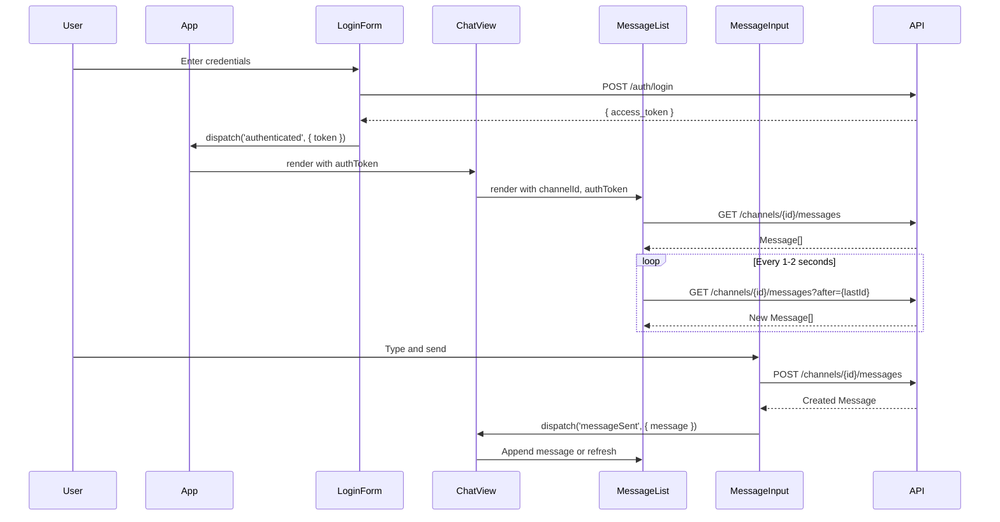

# Design Document

## Overview

This design document describes the architecture and implementation approach for a minimal Svelte frontend MVP that enables visual verification of the Discord-like messaging backend. The frontend consists of 5 Svelte components communicating via props and events, using the fetch API for HTTP requests.

The system is intentionally minimal:
- No WebSockets (polling only)
- No routing
- No external state management
- No global mutable state
- Hardcoded channel ID for MVP

## Architecture

```mermaid
graph TB
    subgraph "Browser"
        App[App.svelte]
        LF[LoginForm.svelte]
        CV[ChatView.svelte]
        ML[MessageList.svelte]
        MI[MessageInput.svelte]
    end

    subgraph "Backend API"
        AUTH[POST /auth/login]
        GET_MSG[GET /channels/{id}/messages]
        POST_MSG[POST /channels/{id}/messages]
    end

    App -->|unauthenticated| LF
    App -->|authenticated| CV
    LF -->|POST credentials| AUTH
    LF -->|emit authenticated| App
    
    CV --> ML
    CV --> MI
    
    ML -->|GET messages| GET_MSG
    ML -->|poll with after| GET_MSG
    
    MI -->|POST message| POST_MSG
    MI -->|emit messageSent| CV
    CV -->|trigger refresh| ML
```

### Component Communication Flow



## Components and Interfaces

### 1. App.svelte

**Responsibilities:**
- Manage authentication state (authenticated/unauthenticated)
- Conditionally render LoginForm or ChatView
- Store access token in memory

**State:**
```typescript
let authToken: string | null = null;
let isAuthenticated: boolean = false;
```

**Event Handlers:**
```typescript
function handleAuthenticated(event: CustomEvent<{ token: string }>) {
  authToken = event.detail.token;
  isAuthenticated = true;
}
```

**Template Logic:**
```svelte
{#if isAuthenticated}
  <ChatView {authToken} />
{:else}
  <LoginForm on:authenticated={handleAuthenticated} />
{/if}
```

### 2. LoginForm.svelte

**Responsibilities:**
- Render email and password inputs
- Submit credentials to POST /auth/login
- Emit authenticated event on success
- Display error inline on failure

**Props:** None

**Events:**
- `authenticated`: Dispatched with `{ token: string }` on successful login

**State:**
```typescript
let email: string = '';
let password: string = '';
let error: string = '';
let loading: boolean = false;
```

**API Call:**
```typescript
async function handleSubmit() {
  loading = true;
  error = '';
  
  try {
    const response = await fetch('/auth/login', {
      method: 'POST',
      headers: { 'Content-Type': 'application/json' },
      body: JSON.stringify({ email, password })
    });
    
    if (!response.ok) {
      const data = await response.json();
      throw new Error(data.message || 'Login failed');
    }
    
    const data = await response.json();
    dispatch('authenticated', { token: data.access_token });
  } catch (err) {
    error = err instanceof Error ? err.message : 'Login failed';
  } finally {
    loading = false;
  }
}
```

### 3. MessageList.svelte

**Responsibilities:**
- Fetch messages on mount
- Order messages by Snowflake ID (ascending)
- Display author_id, content, created_at for each message
- Poll for new messages every 1-2 seconds
- Stop polling on unmount

**Props:**
```typescript
export let channelId: string;
export let authToken: string;
```

**State:**
```typescript
let messages: Message[] = [];
let error: string = '';
let pollInterval: number | null = null;
```

**Types:**
```typescript
interface Message {
  id: string;
  author_id: string;
  content: string;
  created_at: string;
}
```

**API Calls:**
```typescript
async function fetchMessages(after?: string) {
  const url = after 
    ? `/channels/${channelId}/messages?after=${after}`
    : `/channels/${channelId}/messages`;
    
  const response = await fetch(url, {
    headers: { 'Authorization': `Bearer ${authToken}` }
  });
  
  if (!response.ok) {
    throw new Error('Failed to fetch messages');
  }
  
  return response.json() as Promise<Message[]>;
}
```

**Lifecycle:**
```typescript
import { onMount, onDestroy } from 'svelte';

onMount(async () => {
  try {
    const fetched = await fetchMessages();
    messages = sortBySnowflake(fetched);
  } catch (err) {
    error = err instanceof Error ? err.message : 'Failed to load messages';
  }
  
  // Start polling
  pollInterval = setInterval(pollNewMessages, 1500);
});

onDestroy(() => {
  if (pollInterval) clearInterval(pollInterval);
});

async function pollNewMessages() {
  const lastId = messages.length > 0 ? messages[messages.length - 1].id : undefined;
  try {
    const newMessages = await fetchMessages(lastId);
    if (newMessages.length > 0) {
      messages = [...messages, ...sortBySnowflake(newMessages)];
    }
  } catch (err) {
    // Silent fail on poll - don't overwrite existing error
  }
}
```

**Sorting:**
```typescript
function sortBySnowflake(msgs: Message[]): Message[] {
  return [...msgs].sort((a, b) => {
    // Snowflake IDs are numeric strings, compare as BigInt for accuracy
    return BigInt(a.id) < BigInt(b.id) ? -1 : BigInt(a.id) > BigInt(b.id) ? 1 : 0;
  });
}
```

**Public Method (for external refresh):**
```typescript
export function appendMessage(message: Message) {
  messages = [...messages, message];
}
```

### 4. MessageInput.svelte

**Responsibilities:**
- Render text input and send button
- POST message to /channels/{channelId}/messages
- Clear input on success
- Emit messageSent event
- Display error inline on failure

**Props:**
```typescript
export let channelId: string;
export let authToken: string;
```

**Events:**
- `messageSent`: Dispatched with `{ message: Message }` on successful send

**State:**
```typescript
let content: string = '';
let error: string = '';
let loading: boolean = false;
```

**API Call:**
```typescript
async function handleSend() {
  if (!content.trim()) return;
  
  loading = true;
  error = '';
  
  try {
    const response = await fetch(`/channels/${channelId}/messages`, {
      method: 'POST',
      headers: {
        'Content-Type': 'application/json',
        'Authorization': `Bearer ${authToken}`
      },
      body: JSON.stringify({ content })
    });
    
    if (!response.ok) {
      const data = await response.json();
      throw new Error(data.message || 'Failed to send message');
    }
    
    const message = await response.json();
    content = '';
    dispatch('messageSent', { message });
  } catch (err) {
    error = err instanceof Error ? err.message : 'Failed to send message';
  } finally {
    loading = false;
  }
}
```

### 5. ChatView.svelte

**Responsibilities:**
- Compose MessageList and MessageInput
- Maintain hardcoded channel ID
- Handle messageSent event from MessageInput
- Update MessageList when new messages arrive

**Props:**
```typescript
export let authToken: string;
```

**State:**
```typescript
// Hardcoded for MVP - replace with actual channel ID from your backend
const CHANNEL_ID = '123456789012345678';

let messageListRef: MessageList;
```

**Event Handlers:**
```typescript
function handleMessageSent(event: CustomEvent<{ message: Message }>) {
  // Append the sent message to the list immediately
  messageListRef.appendMessage(event.detail.message);
}
```

**Template:**
```svelte
<div class="chat-view">
  <MessageList 
    bind:this={messageListRef}
    channelId={CHANNEL_ID} 
    {authToken} 
  />
  <MessageInput 
    channelId={CHANNEL_ID} 
    {authToken} 
    on:messageSent={handleMessageSent}
  />
</div>
```

## Data Models

### Message Type

```typescript
interface Message {
  id: string;           // Snowflake ID
  author_id: string;    // Snowflake ID of message author
  content: string;      // Message text content
  created_at: string;   // ISO 8601 timestamp
}
```

### Login Response

```typescript
interface LoginResponse {
  access_token: string;
  refresh_token: string;  // Not used in MVP
  expires_in: number;     // Not used in MVP
}
```

### API Error Response

```typescript
interface ApiError {
  message: string;
  code?: string;
}
```

## API Integration

### Base URL Configuration

The frontend will use relative URLs, expecting a proxy or same-origin backend:

```typescript
// All API calls use relative paths
// /auth/login
// /channels/{channelId}/messages
```

For development, Vite's proxy configuration will forward requests to the backend.

### Request Headers

All authenticated requests include:
```
Authorization: Bearer <access_token>
Content-Type: application/json
```

### Endpoints Used

| Method | Endpoint | Purpose |
|--------|----------|---------|
| POST | /auth/login | Authenticate user |
| GET | /channels/{id}/messages | Fetch message history |
| GET | /channels/{id}/messages?after={id} | Poll for new messages |
| POST | /channels/{id}/messages | Send a message |

## Error Handling

Error handling is minimal per requirements:

1. **Login Errors**: Display error message inline below form
2. **Fetch Errors**: Display error message inline in MessageList
3. **Send Errors**: Display error message inline in MessageInput
4. **Poll Errors**: Silent fail (don't disrupt existing messages)

No retry logic, no toast system, no global error handling.

## Project Structure

```
frontend/
├── src/
│   ├── components/
│   │   ├── LoginForm.svelte
│   │   ├── MessageList.svelte
│   │   ├── MessageInput.svelte
│   │   └── ChatView.svelte
│   ├── App.svelte
│   ├── main.ts
│   └── types.ts
├── index.html
├── package.json
├── tsconfig.json
├── vite.config.ts
└── svelte.config.js
```

## Development Setup

### Dependencies

```json
{
  "devDependencies": {
    "@sveltejs/vite-plugin-svelte": "^3.0.0",
    "svelte": "^4.0.0",
    "svelte-check": "^3.0.0",
    "typescript": "^5.0.0",
    "vite": "^5.0.0"
  }
}
```

### Vite Configuration

```typescript
// vite.config.ts
import { defineConfig } from 'vite';
import { svelte } from '@sveltejs/vite-plugin-svelte';

export default defineConfig({
  plugins: [svelte()],
  server: {
    proxy: {
      '/auth': 'http://localhost:3000',
      '/channels': 'http://localhost:3000'
    }
  }
});
```


## Correctness Properties

*A property is a characteristic or behavior that should hold true across all valid executions of a system—essentially, a formal statement about what the system should do. Properties serve as the bridge between human-readable specifications and machine-verifiable correctness guarantees.*

The following properties are derived from the acceptance criteria. Given this is a UI-focused MVP with minimal logic, most properties focus on data transformation and API interaction patterns.

### Property 1: Message Ordering by Snowflake ID

*For any* array of messages with Snowflake IDs, after sorting, each message's ID SHALL be less than or equal to the next message's ID when compared as BigInt values.

**Validates: Requirements 2.2**

### Property 2: Authorization Header Inclusion

*For any* authenticated API request (GET messages, POST message), the request SHALL include an Authorization header with the format "Bearer {token}" where token is the stored access token.

**Validates: Requirements 2.5, 4.6**

### Property 3: Polling After Parameter

*For any* polling request after the initial message fetch, the request URL SHALL include the query parameter `after={lastMessageId}` where lastMessageId is the ID of the most recent message in the current list.

**Validates: Requirements 3.2**

### Property 4: Message List Append Invariant

*For any* set of new messages received from polling, the message list length after appending SHALL equal the previous length plus the count of new messages, and all new messages SHALL appear after existing messages.

**Validates: Requirements 3.3**

### Property 5: Input Clear on Success

*For any* successful message send operation, the input field content SHALL be empty immediately after the operation completes.

**Validates: Requirements 4.3**

### Property 6: Message Rendering Completeness

*For any* message object, the rendered output SHALL contain the author_id, content, and a formatted timestamp derived from created_at.

**Validates: Requirements 2.3**

### Property 7: Error Display on API Failure

*For any* API request that returns a non-2xx status code, the component SHALL display an error message to the user (inline in the relevant component).

**Validates: Requirements 1.4, 2.4, 4.5**

## Testing Strategy

### Unit Tests

Unit tests will verify specific examples and edge cases:

1. **LoginForm**: Test form submission, error display, loading state
2. **MessageList**: Test initial fetch, message rendering, empty state
3. **MessageInput**: Test input validation, send button state, error display
4. **ChatView**: Test component composition, event handling
5. **App**: Test conditional rendering based on auth state

### Property-Based Tests

Property-based tests will use fast-check to verify universal properties:

1. **Snowflake Sorting**: Generate random arrays of Snowflake-like IDs, verify sorting produces ascending order
2. **Message Append**: Generate random message arrays and new message batches, verify append behavior
3. **Authorization Header**: Generate random tokens, verify header format

### Testing Framework

- **Unit Tests**: Vitest with @testing-library/svelte
- **Property Tests**: fast-check integrated with Vitest
- **Minimum iterations**: 100 per property test

### Test File Structure

```
frontend/
├── src/
│   ├── components/
│   │   ├── LoginForm.svelte
│   │   ├── LoginForm.test.ts
│   │   ├── MessageList.svelte
│   │   ├── MessageList.test.ts
│   │   ├── MessageInput.svelte
│   │   ├── MessageInput.test.ts
│   │   ├── ChatView.svelte
│   │   └── ChatView.test.ts
│   ├── App.svelte
│   ├── App.test.ts
│   ├── utils.ts
│   └── utils.property.test.ts  # Property tests for sorting, etc.
```

## Notes

- The frontend is intentionally minimal - no polish, no advanced features
- Channel ID is hardcoded; update CHANNEL_ID constant in ChatView.svelte for your environment
- Backend must be running on localhost:3000 (or update vite.config.ts proxy)
- Token is stored in memory only; page refresh requires re-login
